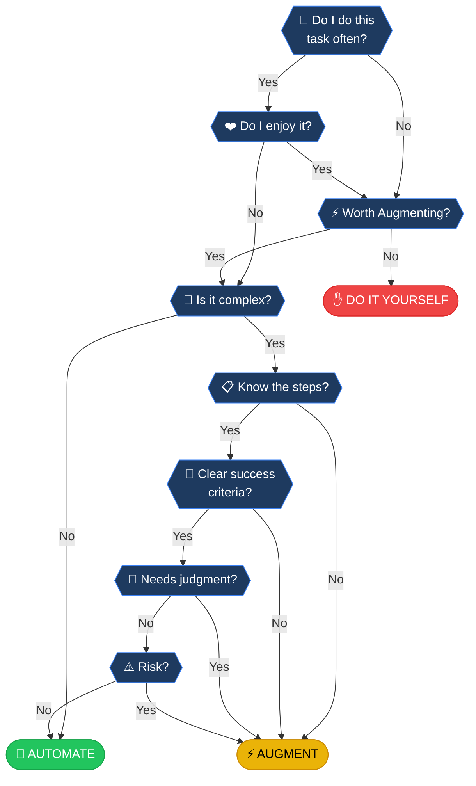

# Frequency Analysis Framework

> The classic "Should I automate this?" decision tree. Start at the top and follow your answers.

## The Decision Flowchart

---

## Decision Nodes Explained

Click any node below to dive deeper:

:::steps

### 1. Do I do this task often?
**FREQUENCY ANALYSIS**: One-off tasks rarely justify setup time. We're looking for the daily grind, the weekly report, the recurring chore.

[Learn more →](../nodes/often)

### 2. Do I enjoy it?
**MORALE CHECK**: Even inefficient tasks have value if they maintain sanity or joy. Don't automate away your hobbies.

[Learn more →](../nodes/enjoy)

### 3. Worth Augmenting?
**EFFICIENCY AUDIT**: Can a tool do the heavy lifting? A dishwasher augments dishwashing; a spellchecker augments writing.

[Learn more →](../nodes/augmenting)

### 4. Is it complex?
**COMPLEXITY THRESHOLD**: High complexity creates fragile systems. A task with simple logic but data trapped in emails is still complex.

[Learn more →](../nodes/complex)

### 5. Know the steps?
**PROCESS MAPPING**: You cannot delegate what you can't explain. If the process lives only in your head, no system can replicate it.

[Learn more →](../nodes/steps)

### 6. Clear success criteria?
**TARGET ACQUISITION**: A system needs to know when to stop. "Write a good email" is vague; "Send the PDF invoice" is clear.

[Learn more →](../nodes/success)

### 7. Needs judgment?
**COGNITIVE LOAD**: Tasks requiring empathy, taste, negotiation, or ethics need a human soul.

[Learn more →](../nodes/judgment)

### 8. Risk?
**HAZARD ASSESSMENT**: If the system fails, is it a minor annoyance or a catastrophe? Don't let a robot hold the baby.

[Learn more →](../nodes/risk)

:::

---

## Outcomes

| Outcome | Description |
|---------|-------------|
| [🤖 AUTOMATE](../outcomes/automate) | The machine works while you sleep. Full delegation. |
| [⚡ AUGMENT](../outcomes/augment) | You're the pilot; tech is the suit. Human-in-the-loop. |
| [✋ DIY](../outcomes/diy) | Sometimes the old ways are best. Manual is fine. |
