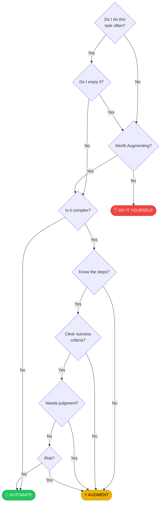

# Automation Decision Frameworks

> Choose your framework to assess if a task should be automated, augmented, or done manually.

## Available Frameworks

:::cards
::card{icon="clock" title="Frequency Analysis" link="./frameworks/frequency-analysis/"}
The classic decision tree. Start with "Do I do this often?" and follow the path to your answer.
::
::card{icon="check-circle" title="ARC Method" link="#coming-soon"}
**Coming Soon** — Enterprise-grade assessment across 5 dimensions: Management, People, Processes, IT, Finance.
::
::card{icon="list-ordered" title="Vandra 6-Step" link="#coming-soon"}
**Coming Soon** — Data-driven framework from 100+ discovery interviews.
::
::card{icon="layers" title="Ripla Spectrum" link="#coming-soon"}
**Coming Soon** — Augmentation levels from Information to Hybrid automation.
::
:::

---

## Quick Start: The Flowchart

> **Click on any node or outcome above to learn more about that decision point.**

## How to Use This Tool

1. **Start with a task** you're considering for automation
2. **Answer the first question**: Do you do this often?
3. **Follow the path** based on your honest answers
4. **Reach an outcome**: Automate, Augment, or DIY
5. **Read the guidance** for your specific situation

---

## The Three Outcomes

| Outcome | When to Use | Examples |
|---------|-------------|----------|
| 🤖 **AUTOMATE** | Low-risk, repeatable, clear metrics | Invoice processing, data backups, scheduled reports |
| ⚡ **AUGMENT** | Complex but valuable, needs human oversight | AI-assisted writing, anomaly detection, decision support |
| ✋ **DIY** | Rare, creative, or relationship-focused | One-off tasks, negotiations, creative work |
