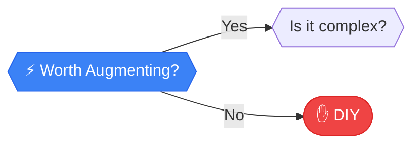

# Worth Augmenting?

> **EFFICIENCY AUDIT**: Can a tool do the heavy lifting?

---

## Analysis

**EFFICIENCY AUDIT**: Can a tool do the heavy lifting? A dishwasher augments dishwashing; a spellchecker augments writing. The question isn't "automate or not"—it's "what layer of help makes sense here?"

:::callout{type="tip"}
**Don't build what you can buy cheaper.** Providers who specialize often have bulk pricing 10-100x better than your DIY cost.
:::

---

## How to Evaluate

Can you buy a tool, build a template, or use software to cut the time in half? Look for leverage.

### Augmentation Options

| Type | Examples | Cost |
|------|----------|------|
| **Templates** | Email templates, document templates | Free |
| **Tools** | Grammarly, Calendly, Zapier | $0-50/mo |
| **Services** | Virtual assistants, SaaS tools | $50-500/mo |
| **Custom automation** | Scripts, bots | Dev time |

---

## Next Steps

Based on your answer:

- **YES, worth augmenting** → [Is it complex?](./complex) - Let's check if we can fully automate
- **NO, not worth it** → [DO IT YOURSELF](../outcomes/diy) - Just do the work manually

---

## Path Context

This is a **mid-tier decision** in the flowchart. Small tools often beat big systems. Consider the effort vs. payoff ratio carefully.

[← Back to Framework](../frameworks/frequency-analysis/)
