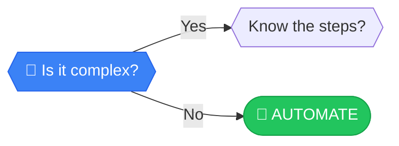

# Is it complex?

> **COMPLEXITY THRESHOLD**: High complexity creates fragile systems.

---

## Analysis

**COMPLEXITY THRESHOLD**: High complexity creates fragile systems. But complexity isn't just logic—it's also data. Dealing with angry customers is complex; filing a standard form is simple. A task with simple logic but data trapped in emails is still complex.

:::callout{type="warning"}
**Hidden complexity**: Data availability is often the blocker, not technical feasibility.
:::

---

## How to Evaluate

Two checks:

1. **Does the task change every time?** If yes, it's complex.
2. **Is the information you need scattered?** In spreadsheets, inboxes, or people's heads? That's hidden complexity.

### Complexity Indicators

| Simple | Complex |
|--------|---------|
| Same steps every time | Steps vary by situation |
| Data in one system | Data scattered across systems |
| Clear rules | Judgment required |
| Predictable inputs | Unpredictable inputs |

---

## Next Steps

Based on your answer:

- **YES, it's complex** → [Know the steps?](./steps) - Let's see if we can at least document the process
- **NO, it's simple** → [AUTOMATE](../outcomes/automate) - Perfect candidate for full automation!

---

## Path Context

Simple tasks with clear data flows are automation gold. Complex tasks push towards **Augmentation** or **Manual** work.

[← Back to Framework](../frameworks/frequency-analysis/)
