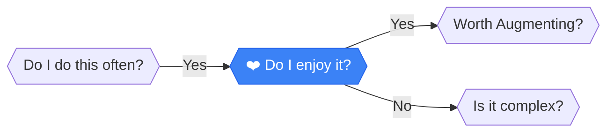

# Do I enjoy it?

> **MORALE CHECK**: Even inefficient tasks have value if they maintain sanity or joy.

---

## Analysis

**MORALE CHECK**: Even inefficient tasks have value if they maintain sanity or joy. Don't automate away your hobbies or the parts of work you love.

:::callout{type="important"}
Automation isn't always the goal. Sometimes the "inefficient" way is the right way.
:::

---

## How to Evaluate

Does doing this task drain your energy or restore it? Be honest.

### Questions to Ask

1. Do you look forward to this task?
2. Would you do it even if you weren't paid?
3. Does completing it give you satisfaction?
4. Is this part of your identity or craft?

---

## Next Steps

Based on your answer:

- **YES, I enjoy it** → [Worth Augmenting?](./augmenting) - Let's enhance the experience, not eliminate it
- **NO, it's a chore** → [Is it complex?](./complex) - Let's try to automate it away

---

## Path Context

You arrived here because you do this task **often**. Now we're checking if you actually *like* doing it—that matters for the optimization strategy.

[← Back to Framework](../frameworks/frequency-analysis/)
