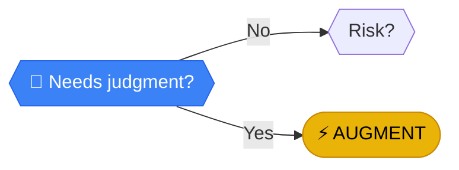

# Needs judgment?

> **COGNITIVE LOAD**: Tasks requiring empathy, taste, negotiation, or ethics need a human soul.

---

## Analysis

**COGNITIVE LOAD**: Tasks requiring empathy, taste, negotiation, or ethics need a human soul. Machines can follow rules, but they can't read the room.

:::callout{type="important"}
Judgment calls act as a **hard stop** for pure automation.
:::

---

## How to Evaluate

Does the task involve:

- **Reading the room** - Social dynamics, timing, context
- **Aesthetic choices** - Design, tone, style
- **Sensitive situations** - Complaints, conflicts, crises
- **Ethical decisions** - Right vs. wrong, competing values
- **Negotiations** - Persuasion, compromise, relationship management

---

## Next Steps

Based on your answer:

- **NO, pure logic** → [Risk?](./risk) - Cold hard logic can be automated. Final safety check.
- **YES, needs human touch** → [AUGMENT](../outcomes/augment) - Use AI/Tools to draft, Human to polish and connect

---

## Examples

| No Judgment Needed | Judgment Needed |
|-------------------|-----------------|
| Calculate invoice total | Negotiate pricing |
| Send scheduled email | Respond to complaint |
| Sort files by date | Curate content for audience |
| Log data entry | Decide on exceptions |

[← Back to Framework](../frameworks/frequency-analysis/)
