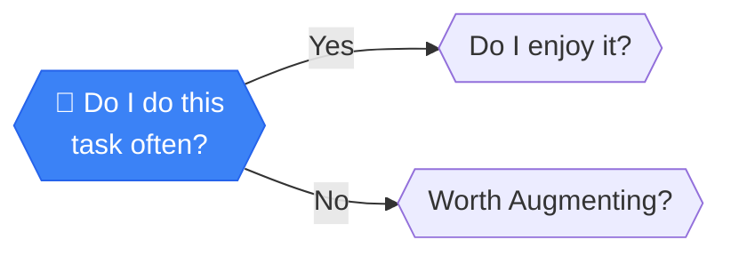

# Do I do this task often?

> **FREQUENCY ANALYSIS**: One-off tasks rarely justify the setup time for a system.

---

## Analysis

**FREQUENCY ANALYSIS**: One-off tasks rarely justify the setup time for a system. We are looking for the daily grind, the weekly report, the recurring chore. Time wasters hide in plain sight—track where your hours actually go.

:::callout{type="tip"}
**Pro tip**: Log your time for a week—you'll be surprised where the hours go.
:::

---

## How to Evaluate

Check your calendar or to-do list, dweller. 

- **If it eats hours every week** → it's a target for optimization
- **If it's once a year** → move on, not worth the setup

### Quick Assessment

| Frequency | Recommendation |
|-----------|----------------|
| Multiple times daily | High priority for automation analysis |
| Weekly | Worth investigating |
| Monthly | Consider simple augmentation |
| Yearly or less | Probably not worth automating |

---

## Next Steps

Based on your answer:

- **YES, I do this often** → [Do I enjoy it?](./enjoy) - Check if this drains or energizes you
- **NO, it's rare** → [Worth Augmenting?](./augmenting) - Maybe a simple tool can help

---

## Path Context

This is the **starting node** of the Frequency Analysis framework. Begin your assessment here and follow the decision tree based on your honest answers.

[← Back to Framework](../frameworks/frequency-analysis/)
