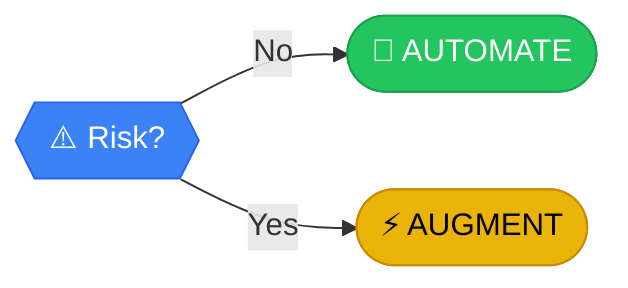

# Risk?

> **HAZARD ASSESSMENT**: If the system fails, is it a minor annoyance or a catastrophe?

---

## Analysis

**HAZARD ASSESSMENT**: If the system fails, is it a minor annoyance or a catastrophe? Don't let a robot hold the baby. 

Risk isn't just technical—it's organizational. Even low-risk automation fails if leadership doesn't support it or the team resists change.

:::callout{type="caution"}
Technical risk is obvious; **organizational risk** is silent and deadly.
:::

---

## How to Evaluate

Three checks:

1. **What's the worst-case if this breaks?**
   - Minor inconvenience vs. major financial/legal/safety impact

2. **Does your organization have the appetite for this change?**
   - Leadership buy-in, budget, timeline tolerance

3. **Will the team embrace or sabotage it?**
   - Change resistance, training needs, political dynamics

---

## Next Steps

Based on your answer:

- **NO, low risk** → [AUTOMATE](../outcomes/automate) - 🎉 Green light! All systems go.
- **YES, high risk** → [AUGMENT](../outcomes/augment) - Keep a human in the driver's seat. Supervised automation.

---

## Risk Matrix

| Impact if Fails | Probability | Recommendation |
|-----------------|-------------|----------------|
| Low | Low | ✅ Automate freely |
| Low | High | ✅ Automate with monitoring |
| High | Low | ⚡ Augment with oversight |
| High | High | ⚡ Augment cautiously |

---

## Path Context

This is the **final safety check** before full automation. You've passed all the other gates. If risk is low, you're cleared for takeoff.

[← Back to Framework](../frameworks/frequency-analysis/)
