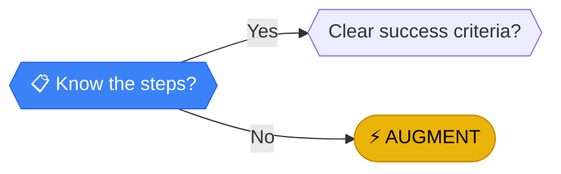

# Know the steps?

> **PROCESS MAPPING**: You cannot delegate what you can't explain.

---

## Analysis

**PROCESS MAPPING**: You cannot delegate what you can't explain. Ambiguity is the enemy of efficiency. If the "process" lives only in your head or varies by mood, no system can replicate it.

:::callout{type="important"}
**Document first, automate second.** The #1 blocker teams hit is undefined processes.
:::

---

## How to Evaluate

Can you write a checklist so precise a stranger could follow it without questions?

### Questions to Ask

1. Does a log or record of this process exist somewhere?
2. Could you hand this off to a new employee with written instructions?
3. Are there exceptions that require judgment calls?
4. Do people do this task differently, or is there one way?

---

## Next Steps

Based on your answer:

- **YES, I know the steps** → [Clear success criteria?](./success) - Great! Now how do we know when it's done correctly?
- **NO, it's undefined** → [AUGMENT](../outcomes/augment) - Use tools to help you figure out the process first

---

## If You Said No...

:::callout{type="tip"}
**How to document your process:**
- Screen record yourself doing the task
- Write notes as you work
- Log every step for a week
- The process exists—it's just not written down yet
:::

[← Back to Framework](../frameworks/frequency-analysis/)
