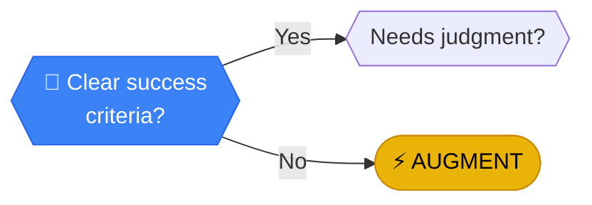

# Clear success criteria?

> **TARGET ACQUISITION**: A system needs to know when to stop.

---

## Analysis

**TARGET ACQUISITION**: A system needs to know when to stop. "Write a good email" is vague; "Send the PDF invoice" is clear. Without measurable success criteria, you can't evaluate if automation is working.

:::callout{type="note"}
If you can't measure success, you can't automate reliably.
:::

---

## How to Evaluate

Is the result **objective** or **subjective**?

| Objective (Clear) | Subjective (Unclear) |
|-------------------|---------------------|
| Pass/Fail | Good/Bad |
| Number reached | Quality met |
| Timestamp logged | Feels right |
| File delivered | Looks professional |

### Better question:
Do you track outcomes for this task? If not, how would you know if automation was working?

---

## Next Steps

Based on your answer:

- **YES, clear criteria** → [Needs judgment?](./judgment) - We know what "done" looks like. Now: does getting there require human intuition?
- **NO, subjective** → [AUGMENT](../outcomes/augment) - Human must remain in the loop to approve results

---

## Path Context

Subjective outcomes force you back to manual oversight. Clear metrics unlock full automation.

[← Back to Framework](../frameworks/frequency-analysis/)
