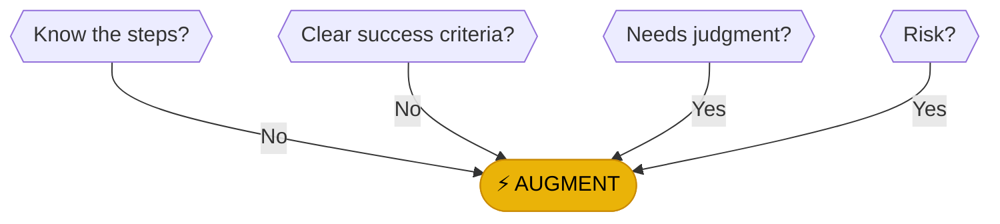

# ⚡ AUGMENT

> **POWER ARMOR**: You are the pilot; the tech is the suit.

---

## The Human-Machine Partnership

Writing with AI, calculating with spreadsheets, building with power tools. Augmentation isn't one thing—it's a spectrum of human-machine collaboration.

:::callout{type="note"}
Best for complex, high-value work requiring human oversight. Match the augmentation level to your task's judgment requirements.
:::

---

## The Augmentation Spectrum

Pick your level based on how much judgment the task requires:

### Level 1: Information
**Tech gathers, you decide.**

- Dashboards showing key metrics
- Alerts when thresholds are crossed
- Summaries of large data sets
- Search and retrieval systems

### Level 2: Analysis
**Tech highlights, you investigate.**

- Pattern detection in data
- Anomaly flagging
- Trend identification
- Comparative analysis

### Level 3: Recommendations
**AI suggests, you approve.**

- AI suggests next actions
- Draft responses for review
- Prioritized task lists
- Option comparison

### Level 4: Hybrid
**Automation handles routine, escalates edge cases.**

- Routine handled automatically
- Exceptions flagged for human review
- Human approves critical decisions
- System learns from corrections

---

## How You Got Here

You reached AUGMENT because one of these was true:

| Reason | What it Means |
|--------|---------------|
| **Don't know the steps** | Use tools to discover the process |
| **No clear success criteria** | Human must judge quality |
| **Needs judgment** | Empathy, taste, ethics required |
| **High risk** | Supervised automation, not blind delegation |

---

## Choosing the Right Augmentation

| Task Characteristic | Recommended Level |
|--------------------|-------------------|
| Data-heavy decisions | Level 1: Information |
| Finding patterns | Level 2: Analysis |
| Repetitive with exceptions | Level 3: Recommendations |
| High-volume, low-risk routine | Level 4: Hybrid |

---

## Real Examples

| Task | Augmentation Approach |
|------|----------------------|
| Writing emails | AI drafts, human reviews and sends |
| Customer support | Suggested responses, human approves |
| Data analysis | AI finds patterns, human interprets |
| Content creation | AI generates options, human selects |
| Quality control | AI flags issues, human verifies |

---

## The Airlines Metaphor

:::callout{type="tip"}
Airlines autopilot most flights, but pilots handle takeoff and landing. That's augmentation—the system handles grunt work, humans handle critical moments.
:::

---

[← Back to Framework](../frameworks/frequency-analysis/)
