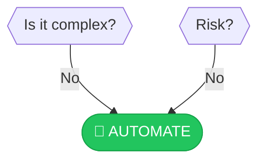

# 🤖 AUTOMATE

> **SYSTEM ONLINE**: The holy grail. The machine works while you sleep.

---

## Congratulations!

You've navigated the decision tree and arrived at **full automation**. This is the ultimate goal for low-risk, high-frequency, boring tasks.

:::callout{type="success"}
The machine works while you sleep. Perfect for data entry, payments, or cleaning floors.
:::

---

## Before You Deploy

But reaching this outcome doesn't mean you're done—implementation can still fail. Run through this final checklist:

### Pre-Launch Checklist

- [ ] **Systems connected** — Can the automation access all required data?
- [ ] **Data accessible** — No manual copy-paste required?
- [ ] **Team ready** — Does everyone know this is happening?
- [ ] **ROI realistic** — Will this actually save more time than it costs?
- [ ] **Build vs Buy decided** — Is there a provider who does this at scale?

:::callout{type="tip"}
**Build vs Buy**: Providers who specialize often have bulk API deals. They may cost less than your DIY solution, plus they handle maintenance.
:::

---

## Implementation Strategy

### Start with a Pilot

1. **One department** — Don't roll out company-wide immediately
2. **One workflow** — Pick the simplest, most predictable process
3. **One week** — Short enough to fail fast, long enough to see patterns

### Monitor and Iterate

| Metric | Why it Matters |
|--------|----------------|
| Error rate | Are exceptions being handled? |
| Time saved | Is the ROI real? |
| User satisfaction | Is the team happy with it? |
| Edge cases | What wasn't anticipated? |

---

## Common Automation Targets

| Category | Examples |
|----------|----------|
| **Data entry** | Form submissions, CRM updates |
| **Reporting** | Scheduled reports, dashboards |
| **Notifications** | Alerts, reminders, follow-ups |
| **File management** | Backups, organization, archiving |
| **Payments** | Invoicing, recurring billing |

---

## What Could Go Wrong

:::callout{type="warning"}
**Skipping the pilot is how most automation projects fail.**
:::

Common failure modes:
- Edge cases not handled → manual intervention needed
- Data quality issues → garbage in, garbage out
- Team resistance → workarounds and sabotage
- Over-engineering → complexity defeats the purpose

---

[← Back to Framework](../frameworks/frequency-analysis/)
