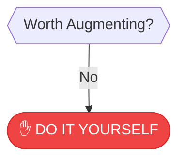

# ✋ DO IT YOURSELF

> **MANUAL OVERRIDE**: Sometimes, the old ways are best.

---

## The Case for Manual Work

Don't overengineer a sandwich. If the task is rare, the tools are expensive, or the process keeps changing, manual work is the rational choice.

:::callout{type="note"}
This is the default state when tech is too risky, costly, or unnecessary. **No shame in DIY.**
:::

---

## Why Manual is Sometimes Best

| Reason | Example |
|--------|---------|
| **Task is rare** | Annual tax filing |
| **Tools are expensive** | One-off custom software |
| **Process keeps changing** | Experimental workflows |
| **Human touch matters** | Relationship building |
| **Learning opportunity** | Skill development |

---

## The Hidden Value of "Inefficiency"

Sometimes "inefficiency" is the point:

- **Human touch** — Clients value personal attention
- **Learning opportunity** — Doing it yourself builds expertise
- **Relationship building** — Face-to-face beats automated
- **Quality control** — Your hands, your standards
- **Creativity** — Constraints breed innovation

---

## When to Revisit

DIY doesn't mean forever. Revisit this decision when:

- [ ] Task frequency increases significantly
- [ ] Better tools become available
- [ ] Process stabilizes and becomes predictable
- [ ] Time cost becomes unsustainable
- [ ] You've documented the process well enough to delegate

---

## Making DIY Efficient

Even if you're doing it yourself, you can still optimize:

### Low-Tech Optimizations

| Technique | Benefit |
|-----------|---------|
| **Checklists** | Never forget a step |
| **Templates** | Consistent starting point |
| **Batching** | Do similar tasks together |
| **Time-boxing** | Limit how long you spend |
| **Delegation** | To humans, not machines |

---

## The Sandwich Rule

:::callout{type="tip" title="Don't Overengineer a Sandwich"}
If you're building a machine to butter bread, you've probably gone too far. Some tasks are simple enough that the overhead of automation exceeds the benefit.
:::

---

## You Reached DIY Because...

The task didn't pass the "Worth Augmenting?" check. Either:

- The frequency is too low
- The existing tools aren't worth the cost
- The process is too simple to need help

**This is a valid outcome.** Not everything needs to be optimized.

---

[← Back to Framework](../frameworks/frequency-analysis/)
